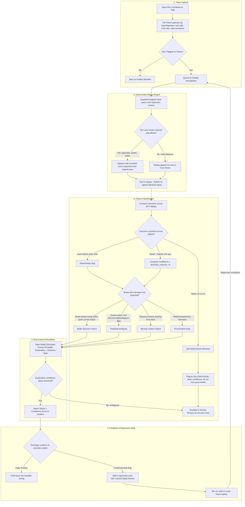

# AgentTrace 🔍
> **Deterministic Replay Engine & Root-Cause Failure Investigator for Production AI Agents**

[](LICENSE)
[](https://www.python.org/downloads/)
[](https://fastapi.tiangolo.com)
[](https://langchain-ai.github.io/langgraph/)
[](https://opentelemetry.io/)

---

## 💡 The Core Problem

When an AI agent fails in production (issues the wrong refund, sends an incorrect email, crashes on a customer request, or hallucinates tool parameters), **it is almost never obvious why**:
- Was it the **model's decision** given valid inputs?
- Was it a **bad or ambiguous tool response**?
- Was it **missing context** that was never passed in state?
- Or was it just **non-deterministic flakiness** (temperature sampling, model variance) where the agent got unlucky once?

Today, most teams shrug, rerun the agent, and move on. The bug quietly resurfaces later.

---

## 🎯 How AgentTrace Solves It

**AgentTrace actually investigates failures instead of guessing.**

1. **Deterministic Replay Sandbox**:
   When an agent run fails, AgentTrace replays the run **$N$ times (default: 10)** against the **exact recorded inputs and mock tool outputs**. It **never re-triggers live external side-effects** (no real credit card charges, no emails, no destructive writes).
2. **Consistency Evaluation**:
   - If it fails the exact same way every time ($10/10$), it is a **Deterministic Bug**.
   - If outcomes vary across replays, it is **Non-Deterministic Behavior** (stochastic flake).
3. **Divergence Analysis ("Where did it go off track?")**:
   - **Model Decision Failure**: Correct inputs/tools, but model picked an invalid action or breached policy.
   - **Tool / Data Ambiguity**: Tool returned unexpected, malformed, or ambiguous payloads (e.g. `pending_chargeback`) that misled the model.
   - **Missing Context Failure**: Prompt or state lacked crucial memory or conversation history referenced by the user.
   - **Environment Issue**: Infrastructure timeouts, network drops, or version mismatches.
4. **Root Cause & Escalation Engine**:
   An open model (Qwen 2.5 / Llama 3.1 via Ollama or OpenAI-compatible endpoint, with high-precision heuristic fallback) pinpoints the **offending evidence span**, writes a human-readable explanation, and assigns a confidence score. If confidence is below threshold or flakiness is detected, it escalates to human review.
5. **Developer Confirmation & CI Regression Suite**:
   Once confirmed, developers can export the failure with 1 click into a **mocked regression test fixture**. CI/CD executes these fixtures on every future deploy. If a regression ever resurfaces, it automatically queues for investigation!

---

## 🏗️ Architecture & Lifecycle



---

## 📦 Tech Stack

- **Tracing & Interception**: OpenTelemetry SDK + custom `@trace_tool` decorator with side-effect safeguards.
- **Agent Framework**: LangGraph state graph adapter (`AgentTraceGraphRunner`).
- **Database & Storage**: SQLAlchemy ORM (SQLite out-of-the-box, PostgreSQL for production).
- **Backend API**: FastAPI + Uvicorn.
- **Root-Cause Analysis**: Open models (Qwen 2.5 / Llama 3.1 via Ollama / OpenAI-compatible endpoint) + rule-based heuristic synthesizer.
- **Frontend Dashboard**: Developer dashboard (Single Page Application with Tailwind CSS and Lucide icons).
- **Deployment**: Docker & Docker Compose.

---

## ⚡ Quickstart

### 1. Installation

Clone and install dependencies:
```bash
git clone <repo-url>
cd Saas
pip install -r requirements.txt
```

### 2. Seed Demo Scenarios & Run Replay Investigation

AgentTrace comes with a built-in Customer Support & Refund LangGraph agent demonstrating all 4 failure types:
```bash
python -m agenttrace.cli seed
```

This will:
- Execute a **Healthy Baseline Run** (saved for divergence diffing).
- Trigger a **Model Decision Failure** (Agent attempts a $450 refund, breaching $50 max policy).
- Trigger a **Tool Data Ambiguity** (Tool returns `pending_chargeback`, confusing downstream logic).
- Trigger a **Non-Deterministic Flake** (Stochastic temperature branching).
- Trigger a **Missing Context Failure** (User references a previous ticket without session history).
- **Replay each failure 10 times** in a sandbox against recorded mocks.
- **Classify each incident** and output root-cause diagnosis.

### 3. Launch the Dashboard & API

```bash
python -m agenttrace.cli serve 8000
```

Open your browser to:
- 📊 **Web UI Dashboard**: [http://127.0.0.1:8000](http://127.0.0.1:8000)
- 📚 **Interactive OpenAPI Docs**: [http://127.0.0.1:8000/docs](http://127.0.0.1:8000/docs)

### 4. Inspect System Metrics in Terminal

```bash
python -m agenttrace.cli stats
```

Output:
```text
==================================================
         AGENTTRACE SYSTEM METRICS
==================================================
 Total Traces Captured:    5
 Total Failures Flagged:   4
 Total Incidents:          4
 Deterministic Bugs:       4
 Non-Deterministic Flakes: 0
 Active Regressions:       1

 Failure Buckets:
   - MISSING_CONTEXT_FAILURE: 1
   - MODEL_DECISION_FAILURE: 2
   - TOOL_DATA_AMBIGUITY: 1
==================================================
```

---

## 🛠️ Instrumenting Your Own Agent

### 1. Decorate Tools with `@trace_tool`

Mark tools to automatically record inputs, outputs, and prevent accidental execution during replays:

```python
from agenttrace.tracer import trace_tool

# Pure read-only tool
@trace_tool(name="fetch_user_profile", is_side_effect=False)
def fetch_user_profile(user_id: str):
    return db.users.find_one({"id": user_id})

# Side-effect tool (NEVER executed during replay; safely mocked)
@trace_tool(name="process_refund", is_side_effect=True)
def process_refund(order_id: str, amount: float):
    return stripe.Refund.create(order_id=order_id, amount=amount)
```

### 2. Wrap LangGraph Graphs with `AgentTraceGraphRunner`

```python
from langgraph.graph import StateGraph
from agenttrace.tracer import AgentTraceGraphRunner
from agenttrace.replay import register_agent_runner

# Build your LangGraph
builder = StateGraph(MyState)
# ... add nodes and edges ...
compiled_graph = builder.compile()

# Wrap with AgentTrace
agent_runner = AgentTraceGraphRunner(
    compiled_graph=compiled_graph,
    agent_name="my_production_agent",
    agent_version="1.0.0"
)

# Register runner for replay investigation
register_agent_runner("my_production_agent", lambda inputs: agent_runner.invoke(inputs))

# Run in production - failures are automatically captured & queued!
result = agent_runner.invoke({"message": "Please refund my order"})
```

---

## 🛡️ Running the CI Regression Test Suite

When a developer confirms a bug in the AgentTrace dashboard, it is saved as a persistent **Regression Fixture**.

To run the regression suite in your CI/CD pipeline:
```bash
python -m agenttrace.cli test-regressions
```

If a regression ever resurfaces:
- The command exits with non-zero status in CI.
- AgentTrace **automatically creates a new Incident** and queues it for replay investigation!

---

## 🐳 Docker Deployment

To launch AgentTrace with PostgreSQL and the Web UI in Docker:

```bash
docker compose up --build -d
```

The server and dashboard will be accessible at `http://localhost:8000`.

---

## 🧪 Running Unit & Integration Tests

```bash
python -m pytest tests/ -v
```

All 9 test suites verify:
- OpenTelemetry span creation and persistence
- Safe side-effect mocking in the Replay Sandbox
- Replay consistency scoring and flake detection
- Divergence detection and failure bucket classification
- REST API endpoints and regression fixture generation
